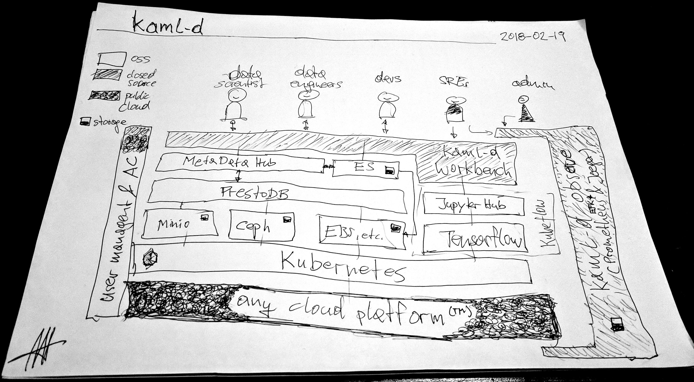
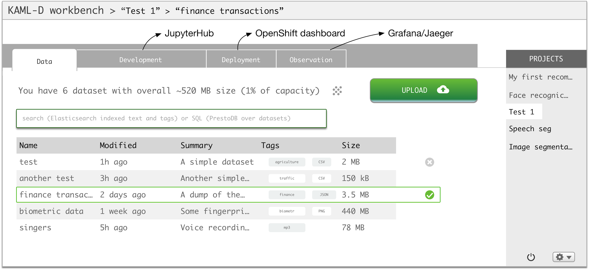

# KAML-D Architecture and UX design

## System Architecture

KAML-D can be deployed on any cloud (or on-premises) platform that allows you to run Kubernetes. Most of the components are open source. As a SaaS, it integrates with the cloud providers (user) identity management system, on-prem something like LDAP.

## Components

Open Source:

- [Kubernetes](https://kubernetes.io/) for workload management and to ensure portability
- [TensorFlow](https://www.tensorflow.org/) for machine learning execution
- [JupyterHub](https://github.com/jupyterhub/jupyterhub) for data scientists (dev/test of algorithms)
- Storage layer: To hold the datasets, [Minio](https://www.minio.io/), [Ceph](https://ceph.com/), as well as cloud-provider specific offerings such as [EBS](https://aws.amazon.com/ebs/), with built-in [dotmesh](https://dotmesh.com/) support for snapshots.
- Metadata layer: [PrestoDB](https://prestodb.io/) and [Elasticsearch](https://www.elastic.co/products/elasticsearch) for indexing and querying the datasets.

Other:

- _KAML-D workbench_: a graphical UI for data scientists, data engineers, developers, and SREs to manage datasets as well as to test and deploy ML algorithms. Builds on the metadata layer to find and visualize datasets. Builds on the storage layer to store and load datasets.
- _KAML-D observe_: a comprehensive observability suite for developers, SREs, and admins to understand the health of the KAML-D platform and troubleshoot issues on the platform and application level:
  - [Prometheus](https://prometheus.io/) for end-to-end monitoring
  - [EFK stack](https://kubernetes.io/docs/tasks/debug-application-cluster/logging-elasticsearch-kibana/) for (aggregrated) logging
  - [Jaeger](http://jaegertracing.io/) for (distributed) tracing

The user management and access control part is outside of the scope of KAML-D but standard integration points such as LDAP are offered.

## User Experience

The UX is central to KAML-D. Users can have different roles (data scientists, data engineers, developers, SREs, admins) and for each role the UX should be pleasing and rich. UX over performance, strive for simplicity and cleanliness. 

