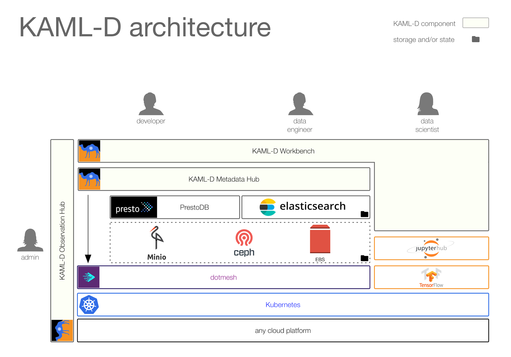
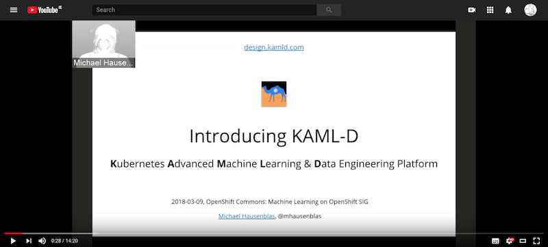
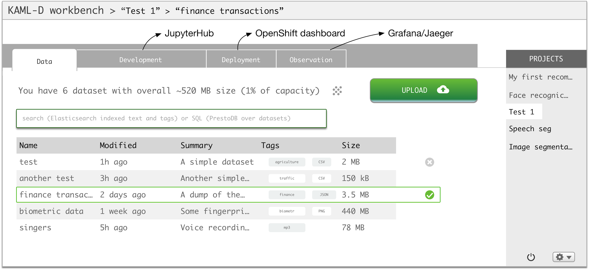

  <a href="motivation">Motivation</a> &#12288;
  <a href="use-cases">Use Cases</a> &#12288;
  <a href="https://github.com/kaml-d/design/issues/new">Leave a comment</a>

## System Architecture

KAML-D can be deployed on any cloud platform as well as on-premises, given you can run Kubernetes. Existing open source components KAML-D uses:

- [Kubernetes](https://kubernetes.io/) for workload management and to ensure portability
- [TensorFlow](https://www.tensorflow.org/) for machine learning execution
- [JupyterLab](https://github.com/jupyterlab/jupyterlab/)/[JupyterHub](https://github.com/jupyterhub/jupyterhub) for data scientists
- Storage layer: To hold the datasets, [Minio](https://www.minio.io/), [Ceph](https://ceph.com/), as well as cloud-provider specific offerings such as [EBS](https://aws.amazon.com/ebs/), with built-in [dotmesh](https://dotmesh.com/) support for snapshots

New open source components KAML-D introduces:

- _KAML-D Workbench_: a graphical UI for data scientists, data engineers, developers, and SREs to manage datasets as well as to test and deploy ML algorithms. Builds on the metadata layer to find and visualize datasets. Builds on the storage layer to store and load datasets.
- _KAML-D Metadata Hub_: a data and metadata layer using [PrestoDB](https://prestodb.io/) and [Elasticsearch](https://www.elastic.co/products/elasticsearch) for indexing and querying datasets.
- _KAML-D Observation Hub_: a comprehensive observability suite for SREs and admins (as well as developers on the app level) to understand the health of the KAML-D platform and troubleshoot issues on the platform and application level:
  - [Prometheus](https://prometheus.io/) and [Grafana](https://grafana.com/) for end-to-end metrics and monitoring/alerting
  - [EFK stack](https://kubernetes.io/docs/tasks/debug-application-cluster/logging-elasticsearch-kibana/) for (aggregrated) logging
  - [Jaeger](http://jaegertracing.io/) for (distributed) tracing

Note that the user management and access control part is outside of the scope of KAML-D but standard integration points such as LDAP are supported.

If you want to learn more about the design decisions and KAML-D's origin, check out this ca. 14 min long YouTube video:

## User Experience

The UX is central to KAML-D. Users can have different roles, for example data scientists, data engineers, developers, SREs, or admins and for each role the UX should be pleasing and rich. UX over performance, strive for simplicity and cleanliness.

For now, the plan is to implement the KAML-D UI as a JupyterLab plug-in.