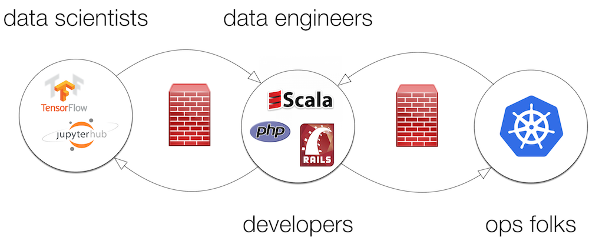

<a href="https://github.com/kaml-d/design/issues/new">Leave a comment …</a>

## What problem does KAML-D solve?

In a nutshell, KAML-D (*Kubernetes Advanced Machine Learning & Data Engineering Platform*) addresses the double divide, often found in teams employing Machine Learning (ML) for their apps:

There are two orthogonal issues to overcome:

- Between data scientists and data engineers/developers
- Between data engineers/developers and ops folks
